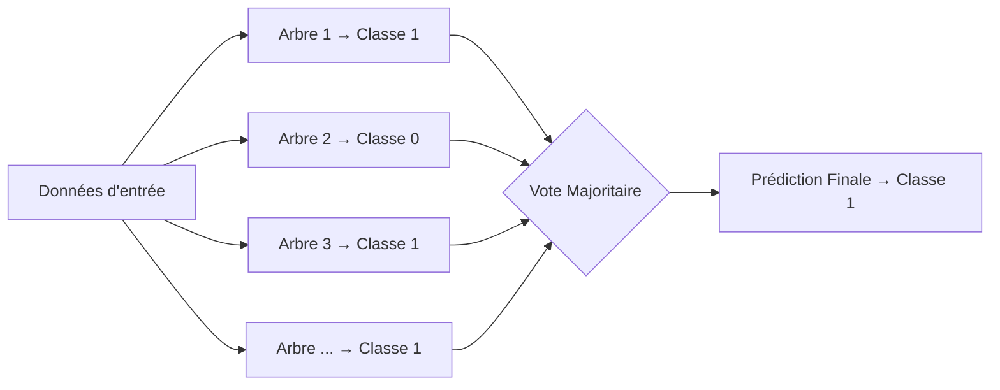
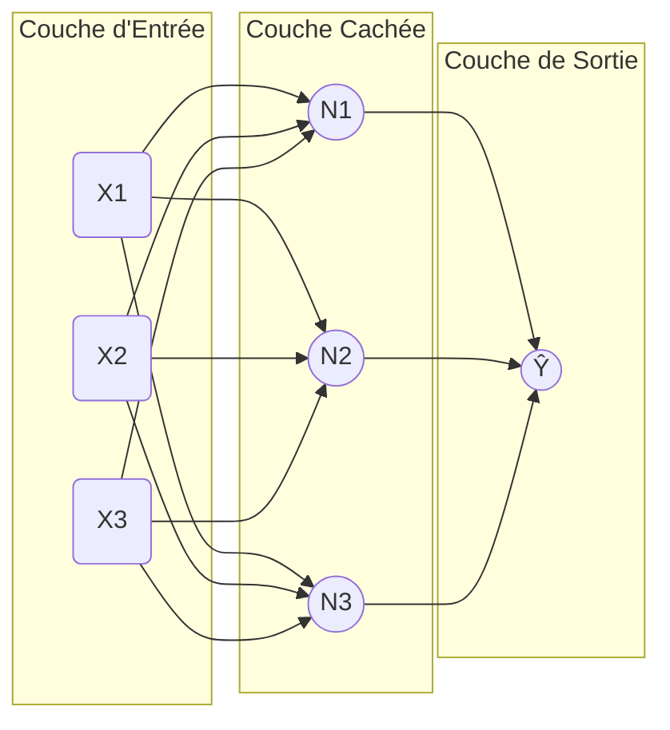
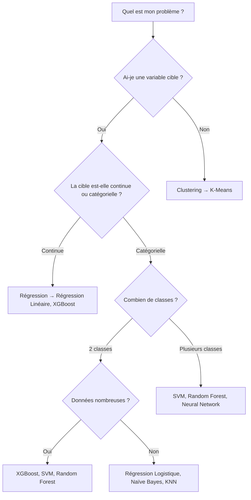
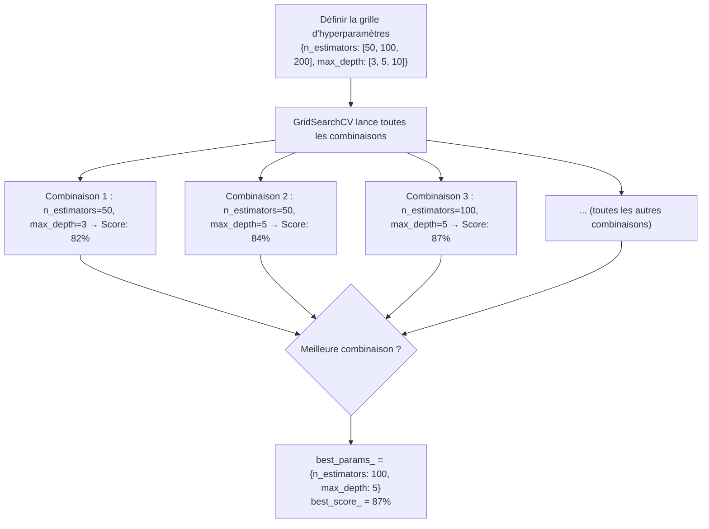

# 🤖 Les 10 Modèles de Machine Learning les Plus Utilisés

Ce document est un guide de référence pour comprendre les 10 algorithmes de Machine Learning les plus populaires. Pour chaque modèle, vous trouverez : son principe de fonctionnement, quand l'utiliser, ses avantages et inconvénients.

---

## 1. 📏 Régression Linéaire (Linear Regression)

### Principe
La Régression Linéaire cherche à tracer une **droite** (ou un hyperplan en multi-dimensions) qui minimise la distance entre les points de données et cette droite. C'est le modèle idéal pour prédire une valeur **continue** (ex: un prix, une température).

La formule apprise est de la forme :

`ŷ = β₀ + β₁x₁ + β₂x₂ + … + βₙxₙ`

Où `β` sont des coefficients appris par minimisation de l'erreur quadratique moyenne (MSE).

### Schéma : Régression Linéaire Simple
```
Y (cible)
│               /
│              / ← Droite apprise
│             /
│     ●  ●  /  ● ← Points de données
│       ● / ●
│        /●
└────────────────── X (feature)
```

### Quand l'utiliser ?
- Prédiction d'un prix (immobilier, action boursière)
- Estimation d'une durée ou d'une consommation
- Relations linéaires entre les variables

| ✅ Avantages | ❌ Inconvénients |
|---|---|
| Très rapide à entraîner | Suppose une relation linéaire |
| Résultats faciles à interpréter | Sensible aux outliers (valeurs aberrantes) |
| Peu de paramètres à régler | Pas adapté aux relations complexes |

---

## 2. 🔵 Régression Logistique (Logistic Regression)

### Principe
Malgré son nom, la Régression Logistique est un modèle de **classification** et non de régression. Elle prédit la **probabilité** qu'un point appartienne à une classe (0 ou 1). Elle s'appuie sur la fonction **Sigmoïde** pour transformer une valeur réelle en une probabilité entre 0 et 1.

`σ(z) = 1 / (1 + e^(-z))`

### Schéma : La Fonction Sigmoïde
```
P(y=1)
1.0 │              ╭─────────  ← Probabilité de classe 1
    │             /
0.5 │ - - - - - /  (seuil de décision)
    │          /
0.0 │─────────╯
    └──────────────────────── z (combinaison linéaire des features)
```

### Quand l'utiliser ?
- Détection de fraude (Oui/Non)
- Diagnostic médical (Malade/Sain)
- Classification d'emails (Spam/Pas Spam)

| ✅ Avantages | ❌ Inconvénients |
|---|---|
| Sortie en probabilités (interprétable) | Hypothèse de linéarité dans l'espace des features |
| Très rapide | N'est pas efficace si les classes ne sont pas linéairement séparables |
| Robuste au sur-apprentissage | Nécessite de bien préparer les features |

---

## 3. 🌳 Arbre de Décision (Decision Tree)

### Principe
Un Arbre de Décision divise récursivement les données en posant des **questions binaires** sur les features (ex: "Feature_2 > 50 ?"). Chaque branche représente une décision, et chaque feuille de l'arbre représente une prédiction finale. La qualité des coupures est mesurée par l'**Indice de Gini** ou le **gain d'information**.

### Schéma : Structure d'un Arbre
```
          [Feature_1 > 0.5 ?]
              /          \
           Oui            Non
            │              │
  [Feature_2 > 30?]     [Classe 0]
      /        \
   Oui          Non
    │            │
[Classe 1]   [Classe 0]
```

### Quand l'utiliser ?
- Quand l'interprétabilité du modèle est primordiale
- Données avec des relations non-linéaires
- Prototypage rapide avant d'essayer des modèles plus complexes

| ✅ Avantages | ❌ Inconvénients |
|---|---|
| Très facile à visualiser et à expliquer | Très sujet au sur-apprentissage (overfitting) |
| Pas besoin de normaliser les données | Instable (un petit changement de données peut créer un arbre très différent) |
| Gère les données mixtes (catégorielles + numériques) | Peut créer des arbres trop profonds |

---

## 4. 🌲 Random Forest (Forêt Aléatoire)

### Principe
Le Random Forest est ce qu'on appelle un **modèle d'ensemble (Ensemble Learning)**. Il crée des **centaines d'arbres de décision** en parallèle, chacun entraîné sur un sous-échantillon aléatoire des données. La prédiction finale est obtenue par un **vote majoritaire** (classification) ou une **moyenne** (régression). Le caractère "aléatoire" de chaque arbre est ce qui rend l'ensemble robuste.

### Schéma : Le Vote du Random Forest


| ✅ Avantages | ❌ Inconvénients |
|---|---|
| Très performant et robuste | Modèle "boîte noire" (difficile à interpréter) |
| Résiste bien au sur-apprentissage | Lent à entraîner avec beaucoup d'arbres |
| Gère bien les valeurs manquantes | Consomme beaucoup de mémoire RAM |

---

## 5. 💪 XGBoost / Gradient Boosting

### Principe
À la différence du Random Forest (arbres entraînés **en parallèle**), XGBoost construit les arbres **séquentiellement**. Chaque nouvel arbre est entraîné pour corriger les **erreurs du modèle précédent**. On dit qu'il "booste" le modèle à chaque étape. C'est l'algorithme qui domine les compétitions Kaggle.

### Schéma : L'Entraînement Séquentiel du Boosting
```
Données → [Arbre 1] → Erreurs → [Arbre 2 corrige] → Erreurs → [Arbre 3 corrige] → … → Prédiction Finale
```

### Paramètres clés à connaître
| Paramètre | Description |
|---|---|
| `n_estimators` | Nombre d'arbres. Plus il y en a, plus c'est long mais potentiellement meilleur. |
| `learning_rate` | Vitesse d'apprentissage. Plus petit = plus stable, mais nécessite plus d'arbres. |
| `max_depth` | Profondeur maximale de chaque arbre. Contrôle la complexité. |

| ✅ Avantages | ❌ Inconvénients |
|---|---|
| Souvent le modèle le plus performant | Beaucoup d'hyperparamètres à régler |
| Intègre la régularisation (L1, L2) | Peut sur-apprendre si mal configuré |
| Très rapide (implémentation C++) | Moins intuitif que le Random Forest |

---

## 6. 🧠 Réseau de Neurones (Neural Network / MLP)

### Principe
Inspiré du cerveau humain, un Réseau de Neurones (ou Perceptron Multi-Couches - MLP) est composé de **couches de neurones**. Chaque neurone d'une couche reçoit des entrées, leur applique une somme pondérée, puis les passe à une **fonction d'activation** (ex: ReLU, Sigmoid) avant de les envoyer à la couche suivante. Le modèle apprend en ajustant les poids via la **rétropropagation** (Backpropagation).

### Schéma : Architecture d'un MLP


| ✅ Avantages | ❌ Inconvénients |
|---|---|
| Peut apprendre des relations extrêmement complexes (non-linéaires) | Très grande quantité de données nécessaire |
| Polyvalent (images, texte, son, données tabulaires) | Long à entraîner (GPU souvent nécessaire) |
| Base du Deep Learning (CNN, RNN, Transformers) | Difficile à interpréter ("boîte noire") |

---

## 7. 📍 K Plus Proches Voisins (K-Nearest Neighbors — KNN)

### Principe
KNN est l'un des algorithmes les plus simples du ML. Pour prédire la classe d'un nouveau point, il trouve les **K points les plus proches** dans les données d'entraînement (selon une distance comme la distance Euclidienne) et effectue un vote majoritaire parmi ces voisins.

### Schéma : Classification avec KNN (K=3)
```
●  ● (Classe A)    ■ (Classe B)

   ●        
     ◉ ← Nouveau point à classer
   ●    ■

Cercle (K=3) : 2 voisins de Classe A, 1 voisin de Classe B
→ Prédiction : Classe A (vote majoritaire)
```

| ✅ Avantages | ❌ Inconvénients |
|---|---|
| Aucun entraînement nécessaire | Très lent lors de la prédiction (calcul de toutes les distances) |
| Simple à comprendre intuitievement | Sensible aux données non-normalisées |
| Naturellement multi-classes | Peu efficace avec beaucoup de dimensions (malédiction de la dimensionnalité) |

---

## 8. 🏹 Support Vector Machine (SVM)

### Principe
Un SVM cherche à tracer l'**hyperplan de séparation** (droite en 2D, plan en 3D) qui **maximise la marge** entre les deux classes. Les points les plus proches de l'hyperplan sont appelés les **Vecteurs de Support**. Le "kernel trick" (noyau RBF, polynomial) permet de traiter des données non-linéairement séparables en les projetant dans un espace de dimension supérieure.

### Schéma : La Marge Maximale du SVM
```
     ●  ●           ■  ■
  ● ●              ■  ■
       ●     ↕ Marge max      ■
        ║═══════════════════║ ← Hyperplan optimal
       ●     ↕               ■
  ● ●         (Vecteurs de Support pointent vers l'hyperplan)
```

| ✅ Avantages | ❌ Inconvénients |
|---|---|
| Très efficace en haute dimension | Lent sur de très grands datasets |
| Efficace quand les données ne sont pas linéairement séparables (avec kernel) | Difficile à interpréter avec un noyau non-linéaire |
| Robuste aux valeurs aberrantes | Très sensible au choix des hyperparamètres (C, gamma) |

---

## 9. 📊 K-Means (Algorithme de Clustering)

### Principe
K-Means est un algorithme d'**apprentissage non-supervisé** (il n'y a pas de "Target" à prédire). Il partitionne les données en **K groupes (clusters)** distincts. L'algorithme est itératif :
1. Il place aléatoirement K centroïdes.
2. Il assigne chaque point au centroïde le plus proche.
3. Il recalcule les centroïdes (barycentre de chaque groupe).
4. Il répète jusqu'à convergence (stabilisation des centroïdes).

### Schéma : Convergence de K-Means (K=2)
```
Avant                 Après
● ● ×               ● ● ×*
  ● ×      →          ● ×  
×  ×                ×  ×  ×*
⊕ = Centroïde initial       ×* = Centroïde final
```

| ✅ Avantages | ❌ Inconvénients |
|---|---|
| Simple et très rapide | Nécessite de choisir K à l'avance |
| Passe à l'échelle facilement | Sensible à l'initialisation et aux outliers |
| Utile pour la segmentation clients | Suppose des clusters de forme sphérique |

---

## 10. 🧪 Naïve Bayes

### Principe
Basé sur le **Théorème de Bayes**, Naïve Bayes calcule la probabilité qu'un point appartienne à une classe, **en supposant que toutes les features sont indépendantes les unes des autres** (hypothèse "naïve"). Malgré cette hypothèse simplificatrice souvent fausse, il obtient d'excellents résultats en pratique, notamment en traitement du texte.

La formule de Bayes :

`P(Classe | Features) ∝ P(Classe) × P(Feature_1 | Classe) × P(Feature_2 | Classe) × …`

### Quand l'utiliser ?
- Classification de texte (Analyse de sentiment, détection de spam)
- Lorsque les données sont limitées mais le modèle doit être rapide
- Comme baseline simple pour comparer avec des modèles plus complexes

| ✅ Avantages | ❌ Inconvénients |
|---|---|
| Extrêmement rapide à entraîner et à prédire | L'hypothèse d'indépendance est souvent fausse |
| Nécessite peu de données | Pas compétitif sur des données tabulaires complexes |
| Excellentes performances sur le texte | Sensible à la corrélation entre features |

---

## 🗺️ Récapitulatif : Quel Modèle Choisir ?



| Modèle | Type | Interprétabilité | Rapidité d'entraînement |
|---|---|---|---|
| Régression Linéaire | Régression | ⭐⭐⭐⭐⭐ | ⚡⚡⚡⚡⚡ |
| Régression Logistique | Classification | ⭐⭐⭐⭐ | ⚡⚡⚡⚡⚡ |
| Arbre de Décision | Les deux | ⭐⭐⭐⭐⭐ | ⚡⚡⚡⚡ |
| Random Forest | Les deux | ⭐⭐ | ⚡⚡⚡ |
| XGBoost | Les deux | ⭐⭐ | ⚡⚡⚡⚡ |
| Réseau de Neurones | Les deux | ⭐ | ⚡ |
| KNN | Les deux | ⭐⭐⭐ | ⚡⚡⚡⚡⚡ (entraînement) |
| SVM | Les deux | ⭐⭐ | ⚡⚡ |
| K-Means | Clustering | ⭐⭐⭐ | ⚡⚡⚡⚡ |
| Naïve Bayes | Classification | ⭐⭐⭐⭐ | ⚡⚡⚡⚡⚡ |

---

## 🔧 11. Optimisation des Modèles : GridSearch et les Hyperparamètres

### Qu'est-ce qu'un Hyperparamètre ?

Il faut bien distinguer deux types de paramètres dans le Machine Learning :

| | Paramètre (appris) | Hyperparamètre (défini par vous) |
|---|---|---|
| **Qui le définit ?** | Le modèle, automatiquement lors de l'entraînement | Vous, **avant** de lancer l'entraînement |
| **Exemples** | Les poids `β` d'une régression linéaire, les seuils d'un arbre | `n_estimators`, `max_depth`, `learning_rate`, `C` |
| **Modifiable après entraînement ?** | Non | Oui, il faut re-entraîner le modèle |

> Un mauvais choix d'hyperparamètres peut transformer un excellent algorithme en un modèle médiocre. L'optimisation des hyperparamètres est une étape incontournable.

---

### 🔎 GridSearchCV : La Recherche Exhaustive

`GridSearchCV` de scikit-learn teste **toutes les combinaisons possibles** d'hyperparamètres que vous lui fournissez. Pour chaque combinaison, il effectue une **validation croisée (Cross-Validation)** afin d'avoir une estimation fiable des performances et d'éviter le sur-apprentissage (overfitting).

#### Schéma : Fonctionnement de la Cross-Validation (K=5)

```
Données complètes : [===|===|===|===|===]

Fold 1 : [TEST|TRAIN|TRAIN|TRAIN|TRAIN] → Score 1
Fold 2 : [TRAIN|TEST|TRAIN|TRAIN|TRAIN] → Score 2
Fold 3 : [TRAIN|TRAIN|TEST|TRAIN|TRAIN] → Score 3
Fold 4 : [TRAIN|TRAIN|TRAIN|TEST|TRAIN] → Score 4
Fold 5 : [TRAIN|TRAIN|TRAIN|TRAIN|TEST] → Score 5

Score Final = Moyenne(Score 1, 2, 3, 4, 5)
```

#### Schéma : Processus global du GridSearch



#### Exemple de Code Python Complet

```python
from sklearn.ensemble import RandomForestClassifier
from sklearn.model_selection import GridSearchCV
from sklearn.metrics import classification_report

# 1. Définir la grille des hyperparamètres à tester
param_grid = {
    'n_estimators': [50, 100, 200],
    'max_depth': [None, 5, 10, 20],
    'min_samples_split': [2, 5, 10],
    'min_samples_leaf': [1, 2, 4]
}

# 2. Créer l'objet GridSearchCV
# cv=5 → 5-fold cross-validation. scoring='f1' → optimise le F1-Score.
grid_search = GridSearchCV(
    estimator=RandomForestClassifier(random_state=42),
    param_grid=param_grid,
    cv=5,
    scoring='f1',
    n_jobs=-1,   # Utilise tous les cœurs du processeur (-1 = tous)
    verbose=2    # Affiche la progression dans le terminal
)

# 3. Lancer la recherche (peut être très long !)
grid_search.fit(X_train, y_train)

# 4. Consulter les meilleurs résultats
print("Meilleurs hyperparamètres trouvés :", grid_search.best_params_)
print("Meilleur score en CV :", grid_search.best_score_)

# 5. Utiliser le meilleur modèle directement
best_model = grid_search.best_estimator_
y_pred = best_model.predict(X_test)
print(classification_report(y_test, y_pred))
```

> ⚠️ **Problème du GridSearch :** Si vous définissez une grande grille, le nombre de combinaisons à tester explose rapidement. Ex: 3 × 4 × 3 × 3 = **108 combinaisons** × 5 folds = **540 entraînements**. Cela peut prendre des heures !

---

### ⚡ RandomizedSearchCV : La Recherche Aléatoire (Alternative Rapide)

Au lieu de tester toutes les combinaisons, `RandomizedSearchCV` en tire aléatoirement un nombre limité (`n_iter`). C'est beaucoup plus rapide pour dégrossir le problème.

```python
from sklearn.model_selection import RandomizedSearchCV
from scipy.stats import randint

# On peut définir des distributions statistiques au lieu de listes fixes
param_distributions = {
    'n_estimators': randint(50, 500),    # Entier aléatoire entre 50 et 500
    'max_depth': [None, 5, 10, 20, 30],
    'min_samples_split': randint(2, 20)
}

random_search = RandomizedSearchCV(
    estimator=RandomForestClassifier(random_state=42),
    param_distributions=param_distributions,
    n_iter=30,       # Teste seulement 30 combinaisons aléatoires au lieu de toutes
    cv=5,
    scoring='roc_auc',
    random_state=42,
    n_jobs=-1
)

random_search.fit(X_train, y_train)
print("Meilleurs params :", random_search.best_params_)
```

---

### 📋 Les Hyperparamètres Clés de Chaque Modèle

#### 🌲 Random Forest

| Hyperparamètre | Description | Impact | Valeurs typiques |
|---|---|---|---|
| `n_estimators` | Nombre d'arbres dans la forêt | Plus d'arbres = plus stable, mais plus lent | `[50, 100, 200, 500]` |
| `max_depth` | Profondeur maximale de chaque arbre | Plus profond = plus complexe, risque de sur-apprentissage | `[None, 5, 10, 20]` |
| `min_samples_split` | Nb minimum d'échantillons pour diviser un nœud | Plus grand = arbre plus simple (régularisation) | `[2, 5, 10]` |
| `min_samples_leaf` | Nb minimum d'échantillons dans une feuille | Plus grand = frontières de décision plus lisses | `[1, 2, 4]` |
| `max_features` | Nb de features à considérer pour chaque coupure | `'sqrt'` est souvent optimal en classification | `['sqrt', 'log2', None]` |
| `class_weight` | Pondération des classes | Très utile si les classes sont déséquilibrées | `['balanced', None]` |

---

#### 💪 XGBoost

| Hyperparamètre | Description | Impact | Valeurs typiques |
|---|---|---|---|
| `n_estimators` | Nombre total d'arbres (boosting rounds) | Plus = meilleur, mais risque d'overfitting sans régularisation | `[100, 300, 500]` |
| `learning_rate` | Taux d'apprentissage (alias `eta`) | Petit = plus de precision, mais nécessite plus d'arbres | `[0.01, 0.05, 0.1, 0.3]` |
| `max_depth` | Profondeur max de chaque arbre | Plus profond = plus expressif mais plus lent | `[3, 5, 7, 10]` |
| `subsample` | Fraction des données utilisées pour chaque arbre | < 1 = sous-échantillonnage stochastique, réduit l'overfitting | `[0.7, 0.8, 1.0]` |
| `colsample_bytree` | Fraction des features utilisées pour chaque arbre | Similaire à `max_features` du Random Forest | `[0.7, 0.8, 1.0]` |
| `reg_alpha` (L1) | Régularisation L1 sur les poids des feuilles | Favorise la parcimonie (certains poids → 0) | `[0, 0.01, 0.1, 1]` |
| `reg_lambda` (L2) | Régularisation L2 sur les poids des feuilles | Pénalise les grands poids, réduit l'overfitting | `[0, 1, 5, 10]` |

---

#### 🌳 Arbre de Décision

| Hyperparamètre | Description | Impact | Valeurs typiques |
|---|---|---|---|
| `max_depth` | Profondeur maximale de l'arbre | Contrôle principal contre l'overfitting | `[3, 5, 10, None]` |
| `criterion` | Mesure de qualité d'une coupure | `gini` (plus rapide) vs `entropy` (gain d'information) | `['gini', 'entropy']` |
| `min_samples_split` | Nb min d'échantillons pour diviser un nœud | Plus grand = arbre plus simple | `[2, 5, 10, 20]` |
| `min_samples_leaf` | Nb min d'échantillons dans une feuille terminale | Évite les feuilles avec très peu de données | `[1, 5, 10]` |
| `max_leaf_nodes` | Nb maximum de feuilles dans l'arbre entier | Limite directement la taille de l'arbre | `[None, 10, 50, 100]` |
| `ccp_alpha` | Paramètre de complexité pour l'élagage (pruning) | Plus grand = arbre plus simple (régularisation) | `[0.0, 0.01, 0.05]` |

---

#### 🔵 Régression Logistique

| Hyperparamètre | Description | Impact | Valeurs typiques |
|---|---|---|---|
| `C` | Inverse de la force de régularisation (1/λ) | Petit C = forte régularisation (modèle plus simple) | `[0.001, 0.01, 0.1, 1, 10, 100]` |
| `penalty` | Type de régularisation appliquée | `'l2'` : pénalise les grands poids. `'l1'` : élimine des features. | `['l1', 'l2', 'elasticnet']` |
| `solver` | Algorithme d'optimisation | Certains solvers ne supportent pas toutes les pénalités | `['lbfgs', 'liblinear', 'saga']` |
| `max_iter` | Nb max d'itérations pour la convergence | À augmenter si le modèle affiche un `ConvergenceWarning` | `[100, 300, 1000]` |

---

#### 🏹 SVM (Support Vector Machine)

| Hyperparamètre | Description | Impact | Valeurs typiques |
|---|---|---|---|
| `C` | Pénalité d'erreur de classification (marge douce) | Grand C = cherche à tout classer correctement (risque d'overfitting). Petit C = plus de marge, plus d'erreurs tolérées. | `[0.1, 1, 10, 100]` |
| `kernel` | Fonction noyau (kernel trick) | `'rbf'` : souvent le meilleur choix. `'linear'` : si les données sont linéairement séparables. | `['rbf', 'linear', 'poly']` |
| `gamma` | Influence d'un seul point d'entraînement (avec kernel RBF) | Grand gamma = frontière très complexe (risque d'overfitting). Petit gamma = frontière plus lisse. | `['scale', 'auto', 0.001, 0.01]` |
| `degree` | Degré du polynôme (uniquement avec `kernel='poly'`) | Plus grand = plus de complexité | `[2, 3, 4]` |

---

#### 📍 KNN

| Hyperparamètre | Description | Impact | Valeurs typiques |
|---|---|---|---|
| `n_neighbors` (K) | Nombre de voisins à considérer | K trop petit = overfitting. K trop grand = underfitting (trop lissé). Souvent impair pour éviter les ex-aequo. | `[3, 5, 7, 11, 15]` |
| `metric` | Mesure de distance utilisée | `'euclidean'` : distance classique. `'manhattan'` : plus robuste aux outliers. | `['euclidean', 'manhattan', 'minkowski']` |
| `weights` | Pondération des voisins | `'uniform'` : tous les voisins ont le même poids. `'distance'` : les voisins proches ont plus de poids. | `['uniform', 'distance']` |
| `algorithm` | Algorithme de recherche des voisins | `'ball_tree'` et `'kd_tree'` sont plus efficaces que `'brute'` en haute dimension | `['auto', 'ball_tree', 'kd_tree']` |

---

### 💡 Conseils et Bonnes Pratiques

1. **Commencez simple.** Entraînez d'abord un modèle avec les paramètres par défaut. C'est votre **baseline**. Mesurez son score. Ensuite seulement, optimisez.

2. **Stratégie en deux temps :**
    - 1️⃣ Utiliser `RandomizedSearchCV` avec une large grille pour identifier rapidement les zones prometteuses.
    - 2️⃣ Utiliser `GridSearchCV` sur une grille plus fine autour des meilleurs paramètres trouvés.

3. **Attention aux données déséquilibrées.** Si votre dataset a 95% de classe 0 et 5% de classe 1, un modèle qui prédit toujours "0" aurait 95% d'accuracy. Utilisez plutôt le **F1-Score** ou le **ROC-AUC** (`scoring='f1'` ou `scoring='roc_auc'` dans GridSearchCV).

4. **Séparez toujours vos données avant de lancer le GridSearch :**
    ```python
    from sklearn.model_selection import train_test_split
    
    X_train, X_test, y_train, y_test = train_test_split(X, y, test_size=0.2, random_state=42)
    
    # Le GridSearch s'entraîne et s'évalue sur X_train UNIQUEMENT.
    grid_search.fit(X_train, y_train)
    
    # X_test est réservé pour l'évaluation finale du meilleur modèle.
    # Ne le touchez pas avant d'avoir trouvé vos hyperparamètres !
    print(grid_search.best_estimator_.score(X_test, y_test))
    ```

5. **Sauvegardez votre meilleur modèle** après optimisation pour ne pas avoir à tout relancer :
    ```python
    import joblib
    
    joblib.dump(grid_search.best_estimator_, "models/mon_modele_optimise.pkl")
    
    # Pour le recharger plus tard dans app.py ou un autre script :
    mon_modele = joblib.load("models/mon_modele_optimise.pkl")
    ```
